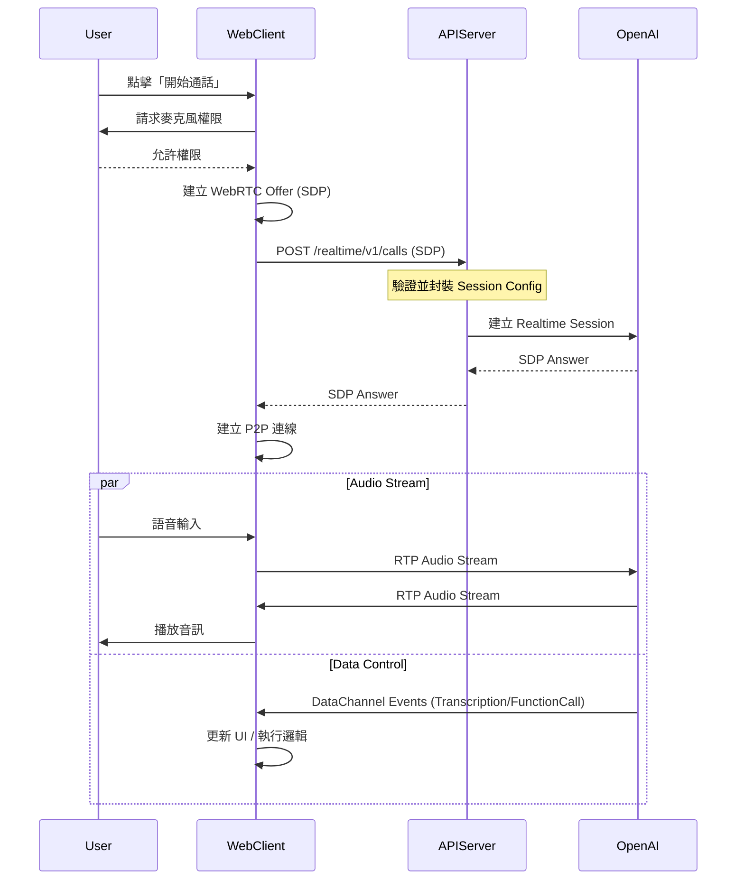

# Web Voice Client 技術文件

## 1. 專案概述

**Web Voice Client** 是一個基於 Web 技術的即時語音對話客戶端，旨在提供與 iOS App (`poc-azure-iftlib-voiceit-ios`) 同等的語音助理體驗。本專案利用 WebRTC 技術實現低延遲語音通訊，並透過 DataChannel 進行雙向即時事件交換，支援即時語音識別 (STT)、語音合成 (TTS) 以及功能呼叫 (Function Calling)。

## 2. 系統架構

系統採用純前端 JavaScript 架構，不依賴複雜的建置工具，確保輕量化與易於整合。

### 2.1 核心流程



### 2.2 模組化設計

專案採用模組化設計，各職責分離：

| 檔案 | 職責 | 關鍵類別/功能 |
|------|------|---------------|
| `main.js` | 應用程式入口與狀態管理 | `AppStateManager`, `handleStateChange` |
| `webrtc.js` | WebRTC 連線與音訊串流管理 | `WebRTCManager` |
| `events.js` | DataChannel 事件處理邏輯 | `EventHandler` |
| `ui.js` | DOM 操作與 UI 更新 | `UIManager` |
| `api.js` | REST API 呼叫 (Auth/Refresh) | `ApiService` |

## 3. 功能特性

### 3.1 WebRTC 音訊串流
- **自動播放策略**: 透過使用者點擊「開始通話」觸發 Context，並利用 `playsInline` 與隱藏 `<audio>` 元素確保在 iOS Safari 與各種瀏覽器上的相容性。
- **回音消除 (AEC)**: `getUserMedia` 配置強制開啟 `echoCancellation` 與 `noiseSuppression`。

### 3.2 雙向 DataChannel 通訊
- 使用 `oai-events` 作為 DataChannel label。
- 支援完整的 OpenAI Realtime API 事件映射，包括：
    - `response.audio_transcript.delta`: 只顯示文字不播放（因為音訊走 WebRTC）。
    - `input_audio_buffer.speech_started`: 偵測使用者說話 (VAD)。
    - `response.function_call_arguments.done`: 接收後端 function call 結果。

### 3.3 Audio Ducking & Barge-in (打斷機制)
為了提供自然的對話體驗，實作了 **Barge-in** 機制：
1. 當收到 `input_audio_buffer.speech_started` 事件（使用者開始說話）：
   - 觸發 `barge_in` 狀態。
   - `WebRTCManager` 立即將遠端音訊 (`remoteAudio`) 設為靜音。
   - UI 顯示 `...` 佔位符。
2. 當 AI 回應開始或狀態轉回 `listening`：
   - 恢復遠端音訊音量。

### 3.4 狀態機管理

應用程式狀態定義如下：

- **IDLE**: 閒置 / 初始狀態。
- **CONNECTING**: 正在建立 WebRTC 連線。
- **LISTENING**: 連線建立，等待使用者說話。
- **RESPONDING**: AI 正在生成回應或播放語音。
- **PROCESSING**: AI 正在執行 Tool/Function (MCP Call)。
- **WAITING**: 等待外部系統回應 (伴隨等候音樂)。
- **DISCONNECTED**: 連線中斷。

## 4. API 整合規格

### 4.1 Realtime Call

- **URL**: `/realtime/v1/calls`
- **Method**: `POST`
- **Content-Type**: `application/sdp`
- **Body**: 純文字 SDP Offer
- **Response**: 純文字 SDP Answer
- **Authetication**: 目前配置為 `permitAll()`，可透過 `SecurityWhitelist` 設定。

### 4.2 Function Calling 映射

支援以下後端定義的 Function Call：

| Function Name | 用途 | UI 行為 |
|---------------|------|---------|
| `repair_ticket` | 建立報修單 | 彈出報修確認卡片 (`showRepairConfirmCard`) |
| `query_user_equipments` | 查詢設備 | 顯示設備清單供選擇 (`showDeviceSelection`) |

*註：舊版別名 `submit_repair_ticket` 已移除，統一使用 `repair_ticket`。*

## 5. 配置與模式

`js/main.js` 中的 `CONFIG` 物件控制運行模式：

```javascript
const CONFIG = {
    API_BASE_URL: 'http://localhost:8080',
    MOCK_MODE: false,    // true: 純前端模擬，不連後端
    GUEST_MODE: true,    // true: 跳過登入畫面，直接進入通話介面
    DEBUG: true          // true: 開啟詳細 Console Log
};
```

## 6. 已知限制與注意事項

1. **瀏覽器安全性**: 
   - `getUserMedia` 僅在 `localhost` 或 `https` 環境下工作。
   - 建議使用 Chrome 或 Safari 進行測試。
2. **Audio Context**:
   - 必須由使用者手勢（點擊按鈕）觸發 `Audio` 播放，否則會被瀏覽器阻擋。
3. **Ghost Audio**:
   - 確保在 `disconnect()` 時將 `<audio>` 元素的 `srcObject` 設為 `null` 並移除引用，防止斷線後仍有殘留聲音。

## 7. 部署說明

本專案為靜態網站，可部署至任何靜態網頁伺服器 (Nginx, Apache, S3, GitHub Pages)。

1. 確保 `CONFIG.API_BASE_URL` 指向正確的後端位址 (需為 HTTPS)。
2. 確認後端 CORS 設定允許該 Domain。
